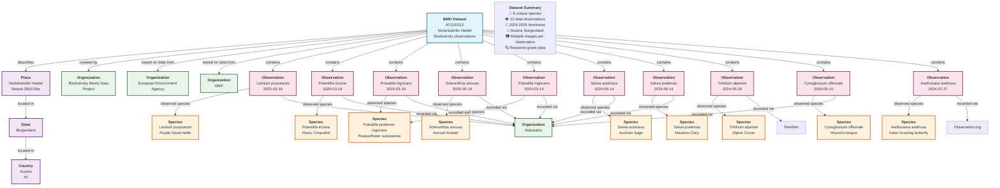

```mermaid

flowchart TD
    %% Define Styles
    classDef dataset fill:#e1f5fe,stroke:#01579b,stroke-width:2px
    classDef place fill:#f3e5f5,stroke:#4a148c,stroke-width:2px
    classDef organization fill:#e8f5e8,stroke:#1b5e20,stroke-width:2px
    classDef species fill:#fff3e0,stroke:#e65100,stroke-width:2px
    classDef observation fill:#fce4ec,stroke:#880e4f,stroke-width:2px

    %% Central Dataset Node
    BMD["<b>BMD Dataset</b><br>AT1101112<br>Nickelsdorfer Haidel<br>Biodiversity observations"]

    %% Places
    NICKELS["<b>Place</b><br>Nickelsdorfer Haidel<br>Natura 2000 Site"]
    AUSTRIA["<b>Country</b><br>Austria<br>AT"]
    BURGENLAND["<b>State</b><br>Burgenland"]
    
    %% Organizations
    BMDORG["<b>Organization</b><br>Biodiversity Meets Data<br>Project"]
    EEA["<b>Organization</b><br>European Environment Agency"]
    GBIFORG["<b>Organization</b><br>GBIF"]
    INAT["<b>Organization</b><br>iNaturalist"]

    %% Species
    LAMPURP["<b>Species</b><br>Lamium purpureum<br>Purple Dead-nettle"]
    POTINC["<b>Species</b><br>Potentilla incana<br>Hoary Cinquefoil"]
    PULSNIG["<b>Species</b><br>Pulsatilla pratensis nigricans<br>Pasqueflower subspecies"]
    SCLANN["<b>Species</b><br>Scleranthus annuus<br>Annual Knawel"]
    SALAUST["<b>Species</b><br>Salvia austriaca<br>Austrian Sage"]
    SALPRAT["<b>Species</b><br>Salvia pratensis<br>Meadow Clary"]
    TRIFALP["<b>Species</b><br>Trifolium alpestre<br>Alpine Clover"]
    CYNOFF["<b>Species</b><br>Cynoglossum officinale<br>Hound's-tongue"]
    ARETH["<b>Species</b><br>Arethusana arethusa<br>False Grayling butterfly"]

    %% Observations
    OBS1["<b>Observation</b><br>Lamium purpureum<br>2025-03-18"]
    OBS2["<b>Observation</b><br>Potentilla incana<br>2025-03-18"]
    OBS3["<b>Observation</b><br>Pulsatilla nigricans<br>2025-03-18"]
    OBS4["<b>Observation</b><br>Scleranthus annuus<br>2025-05-19"]
    OBS5["<b>Observation</b><br>Pulsatilla nigricans<br>2024-03-14"]
    OBS6["<b>Observation</b><br>Salvia austriaca<br>2024-05-14"]
    OBS7["<b>Observation</b><br>Salvia pratensis<br>2024-05-14"]
    OBS8["<b>Observation</b><br>Trifolium alpestre<br>2024-05-28"]
    OBS9["<b>Observation</b><br>Cynoglossum officinale<br>2024-05-10"]
    OBS10["<b>Observation</b><br>Arethusana arethusa<br>2024-07-27"]

    %% Apply Styles
    class BMD dataset
    class NICKELS,AUSTRIA,BURGENLAND place
    class BMDORG,EEA,GBIFORG,INAT organization
    class LAMPURP,POTINC,PULSNIG,SCLANN,SALAUST,SALPRAT,TRIFALP,CYNOFF,ARETH species
    class OBS1,OBS2,OBS3,OBS4,OBS5,OBS6,OBS7,OBS8,OBS9,OBS10 observation

    %% Relationships
    BMD -->|describes| NICKELS
    NICKELS -->|located in| BURGENLAND
    BURGENLAND -->|located in| AUSTRIA
    
    BMD -->|created by| BMDORG
    BMD -->|based on data from| EEA
    BMD -->|based on data from| GBIFORG
    
    BMD -->|contains| OBS1
    BMD -->|contains| OBS2
    BMD -->|contains| OBS3
    BMD -->|contains| OBS4
    BMD -->|contains| OBS5
    BMD -->|contains| OBS6
    BMD -->|contains| OBS7
    BMD -->|contains| OBS8
    BMD -->|contains| OBS9
    BMD -->|contains| OBS10
    
    OBS1 -->|observed species| LAMPURP
    OBS2 -->|observed species| POTINC
    OBS3 -->|observed species| PULSNIG
    OBS4 -->|observed species| SCLANN
    OBS5 -->|observed species| PULSNIG
    OBS6 -->|observed species| SALAUST
    OBS7 -->|observed species| SALPRAT
    OBS8 -->|observed species| TRIFALP
    OBS9 -->|observed species| CYNOFF
    OBS10 -->|observed species| ARETH
    
    OBS1 -->|recorded via| INAT
    OBS2 -->|recorded via| INAT
    OBS3 -->|recorded via| INAT
    OBS4 -->|recorded via| INAT
    OBS5 -->|recorded via| INAT
    OBS6 -->|recorded via| INAT
    OBS7 -->|recorded via| INAT
    OBS8 -->|recorded via| PlantNet
    OBS9 -->|recorded via| INAT
    OBS10 -->|recorded via| Observation.org

    %% Metadata summary
    METADATA["<b>Dataset Summary</b><br>🌿 9 unique species<br>👁️ 10 total observations<br>📅 2024-2025 timeframe<br>📍 Austria, Burgenland<br>📷 Multiple images per observation<br>🔍 Research-grade data"]
```
