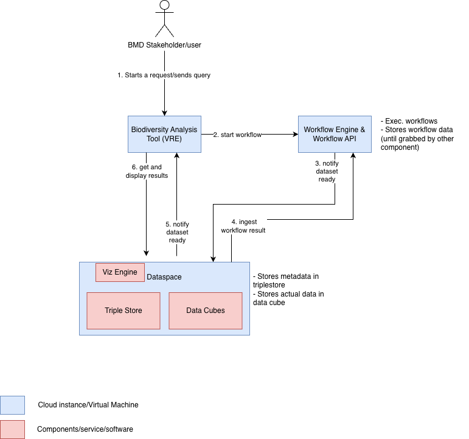

# BMD VRE–Data Space Workflow

## **1. User Initiates a Request**

A BMD stakeholder begins by submitting a query or starting a workflow through a **Biodiversity Analysis Tool (VRE)**.

This could be a request such as:

* “Show predicted distribution for Species X in Site NL9801023,”
* “Run trend analysis for all Annex IV species in the Netherlands,”
* “Calculate drivers of change for habitats exposed to nitrogen deposition.”



<em>Based on initial diagram by Daniel Bauer SGN</em>


## **2. VRE Starts a Workflow**

Based on the user's request, the VRE triggers a workflow using the **Workflow Engine & Workflow API** (this could be same or different cloud resource)
An example of workflow engine is [Argo](https://argoproj.github.io/workflows/) and workflow yaml definition can be found here in [workflow.earth](https://workflow.earth/dataset/cwr/3ad120fbd197bec61231). These yaml definitions 
can include parameters and different artifact details that are needed to run the workflow: 

snippets: 
```
spec:
  arguments:
    parameters:
    - description: Genus of species for distribution modeling
      name: species
      value: Lycopodium
    - description: Number of cores for SDM calculation
      name: numberOfCores
      value: '9'
    - description: URL of CWR source repository
      name: modgpSource
      value: https://github.com/BioDT/uc-CWR.git
    - description: Revision of CWR source
      name: modgpRevision
      value: main
  artifactGC:
    forceFinalizerRemoval: true
  entrypoint: workflow
  onExit: exit-handler
  podGC:
    strategy: OnWorkflowSuccess
  templates:
  - inputs: {}
    metadata: {}
    name: workflow
    outputs: {}
    steps:
    - - arguments:
          parameters:
          - name: numberOfCores
            value: '{{ workflow.parameters.numberOfCores }}'
        name: create-credentials
        template: create-credentials
    - - arguments:
          artifacts:
          - from: '{{ steps.create-credentials.outputs.artifacts.credentials-file
              }}'
            name: credentials-file
          parameters:
          - name: species
            value: '{{ workflow.parameters.species }}'
          - name: source
            value: '{{ workflow.parameters.modgpSource }}'
          - name: codeRevision
            value: '{{ workflow.parameters.modgpRevision }}'
          - name: numberOfCores
            value: '{{ workflow.parameters.numberOfCores }}'
        name: modgp
        template: modgp

```

Different VREs (terrestrial, marine, freshwater) may run different models/scripts, libraries, and input datasets.

---

## **3. Workflow Execution and Dataset Creation**

The workflow executes on the compute layer associated with the VRE. **NOTE: check this wording**

When the workflow finishes:

* it generates one or more **outputs**. These could be datasets, maps, statistics, CSVs, derived rasters, plots etc.
* the Workflow Engine temporarily stores these outputs and notifies the Data Space that a dataset is ready.

At this stage, the output is not yet integrated into the BMD dataspace or visualisation engine.

---

## **4. Data Space Ingests Workflow Results**

The **BMD Data Space** receives the workflow output and processes it into two components:

### **4a. Metadata ingestion**

Semantic metadata describing the dataset (for example species ID, site code, model type, provenance data, timestamps, etc.) is stored.  
These metadata should for alignment around * *siteCode*, * *speciesCode*, * *habitatCode*, * workflow identifiers, * provenance statements (RO-Crate, PROV-O).

Some of these metadata can also already be there via the datacubing process or prior data ingestion.  


### **4b. Data ingestion into the cube or catalogue**

Depending on the nature of the workflow output:

* **Raster or gridded results** are integrated into the **Data Space*. For instance, stored as NetCDF or Zarr for efficiency. 
* **Vector layers** (e.g. occurrence points, site boundaries) are registered as queryable layers in the Data Space catalogue.
* **Tabular outputs** (e.g. trends, summary tables) are stored alongside metadata and made accessible through the dashboard and the Single Access Point.

This ingestion step ensures that VRE outputs are persistently stored, citable, and discoverable.

---

## **5. Data Space Notifies the VRE**

Once the dataset is ingested and indexed, the Data Space notifies the originating VRE.
The VRE now knows:

* **the dataset is ready**,
* where it is stored,
* how it can be visualised,
* what metadata and provenance are associated with it.

This allows each VRE to maintain a clean separation between running analytical workflows and displaying results. NOTE: Check ***some visualisation aspect can be part of the VRE as well** 

---

## **6. Results Retrieved and Visualised**

The VRE requests visualisation via the **Visualisation Engine** integrated into the Data Space. NOTE: ***some visualisation aspect can be part of the VRE as well** ??? 

### **Different visualisation paths exist depending on the dataset:**

* **Raster layers** (from NetCDF/Zarr cubes)
  → shown as interactive web maps (e.g. tiled layers, time slider).

* **Vector outputs**
  → displayed as GeoJSON/OGC Features in the map viewer.

* **Tabular or statistical outputs**
  → shown via charts, tables, or downloadable files.

* **Complex cube slices**
  → rendered as extracted layers (e.g. habitat suitability at time T) directly from the cube engine.

Ideally the visualisation engine standardises the experience across terrestrial, marine, and freshwater VREs, even if the underlying models differ.

Finally, the VRE displays the processed results to the user. 
---

### **Interoperability**

WP3 (data cubes), WP4 (visualisation + data space), and WP5 (VREs) communicate using standard APIs and shared identifiers.

### **Scalability**

Different VREs can run different models while still depositing outputs in a shared FAIR data environment.

### **Reusability**

Outputs (e.g., a modelled distribution map) can be used by:

* other VREs,
* the Single Access Point,

### **Transparency/Provenance**

Every dataset is linked to its origin via Ro-Crate metadata, provenance, and persistent identifiers.


