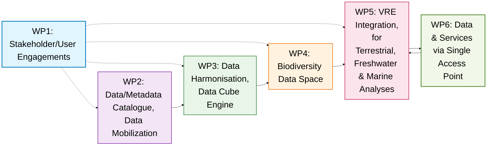
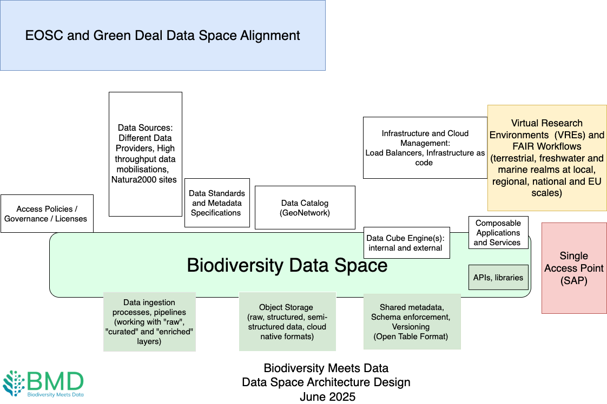

# Biodiversity Data Space

This repository hosts architecture, documentation, and implementation resources for the Biodiversity Meets Data (BMD) Data Space: a cloud-native, FAIR-aligned infrastructure designed to support biodiversity monitoring, conservation planning, and policy reporting.

The Biodiversity Meets Data (BMD) project is creating a data space using cloud-native open infrastructure to support biodiversity monitoring, conservation, and policy across terrestrial, freshwater,
and marine environments. This document (MS19) presents the initial architecture design for the BMD data space, led by Work Package (WP) 4 and developed in coordination with WP2 (data mobilisation),
WP3 (harmonisation), WP5 (Virtual Research Environments), and WP6 (visualisation and Single Access
Point).

The BMD Data Space will host harmonised, FAIR-aligned data cubes derived from high-throughput and legacy sources. These cubes will support scalable workflows, reproducible analysis, and dynamic policy
reporting. Whenever possible, data will be accessed directly from source data providers, with local replication, caching used only when needed for transformation, performance, or reliability and always
preserving metadata and provenance. The architecture aligns with the Green Deal Data Space (GDDS) and EOSC (European Open Science Cloud) Interoperability Frameworks, and adopts open lakehouse
principles (such as composability and the separation of storage, metadata, and compute layers) to maximise flexibility and interoperability. It builds on cloud-native formats like Parquet, Zarr and
GeoParquet, which support scalable, reusable data infrastructure across analytical environments. BMD's design adopts a dual-catalogue model (GeoNetwork for public metadata, open table catalogues for
internal tracking) supports both transparency and operational efficiency. 

Integration across WPs ensures a cohesive backend for user-facing services, with stakeholder needs informing cube design and access patterns. A flexible approach to data quality will allow permissive
integration initially, with tighter validation introduced over time. While infrastructure will be hosted for five years post-project, sustainability strategies remain under
discussion. The architecture supports modular growth, cloud portability, and long-term FAIR data stewardship. This milestone reflects the first four months of development and sets a foundation for
future implementation and stakeholder collaboration. 

The BMD Data Space will integrate high-throughput and legacy biodiversity and environmental data into harmonised, analysis-ready data cubes. It will support access through Virtual Research Environments (VREs), a Single Access Point (SAP), APIs, and standardised metadata catalogues. Built on open lakehouse principles and aligned with the Green Deal Data Space and EOSC frameworks, the infrastructure will enable scalable, interoperable, and reusable biodiversity data services.

In BMD, task 4.1 (Biodiversity Data Space with documentation) is done under WP4: Biodiversity Data Space with computing and visualisation engine

Task 4.1 will design and implement a Biodiversity Data Space for the environmental and biodiversity data. 

A Work Package based view of the data and processes: 

Design digram (work in progress)

References: 

Data Space Blueprint: https://dssc.eu/space/BVE2/1071251457/Data+Spaces+Blueprint+v2.0+-+Home
Open Lakehouse Architecture: https://moderndata101.substack.com/p/lakehouse-20-the-open-system-that
