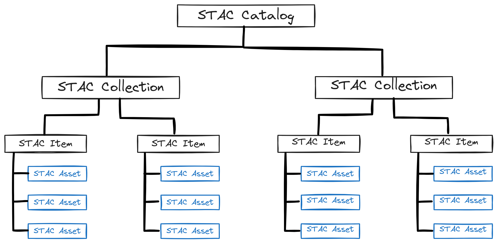
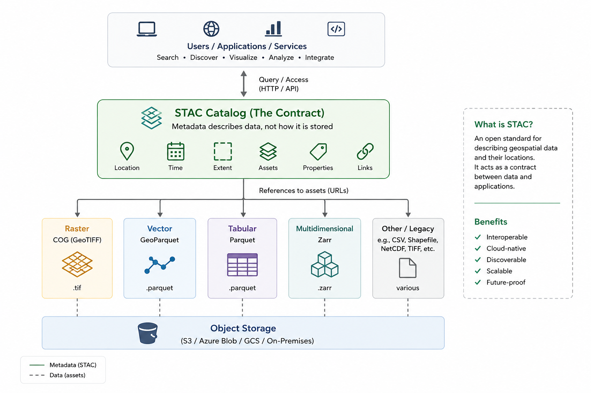

# Why STAC for BMD 

These tests are work in progress. Here are our current ideas and summary. 

From https://www.ogc.org/standards/stac/

"The SpatioTemporal Asset Catalog (STAC) family of specifications aim to standardize the way geospatial asset metadata is structured and queried. A “spatiotemporal asset” is any file that represents information about the Earth at a certain place and time."

In a general sense STAC can be used to describe any digital object and focus on: where it is, what area and time it covers, and how to use it regardless of what format the data itself is stored in.




## Why not just S3 with a good folder name?


A filename like `chelsa_bio_10km_final_v2.zarr` means something to
whoever named it or familiar with the datasets. From a machine readibility and FAIR perspective this is not a best practice. 

Using s3 helps but there is no real folders, no browse option and no way to ask questions like: 

"which files/datasets cover x location and y date range" 

Just having a scalable s3 storage is not enough. 
It stops working the moment an analytics tool, or someone outside the team, needs to find the right data cube and datasets.

## Why not just a SQL table, then?

Yes, we can create a table wit `path, bbox, crs, date`. But: 

- **No shared schema.** Our column names mean something to us. Nothing
  outside the project can query it without reading our docs first.
- **No description of what's inside the file**, so a client still needs to load the full digital object first to understand it. 
- **Doesn't generalize across formats.** A row describing a Zarr cube
  and a row describing a GeoParquet file don't look anything alike. Every consumer needs format-specific logic per row anyway.
- **No API anything already speaks.** A STAC catalog can be queried with
  `pystac-client`, opened in QGIS, or crawled with `stackstac`/`odc-stac`
  out of the box. A custom table needs a custom client, every time.

STAC can be standardised, with a schema and API that is known. 



Fig1: A conceptual vision of how STAC fits in the architecture (image AI generated). 

## How BMD is testing this

We are tesitng our first Data Cubes and analysis, workflow pipeline. We are also working FAIR and Data Space concepts around metadata, data governance, provenance etc. 

For example, there are use cases dealing with GBIF data cubes, COL checklist files, CHELSA bioclimatic variables. Each of these datasets are available from different resources but we need process it locally for our pipelines. 

We will also need to support differnet file formats (csv, JSON, netCDF, parquet, zarr etc). 


The idea is the catalog needs to describe all of these formats in a general manne. A Zarr item, a GeoParquet item, and a COG item all sit in the same
collection, distinguished by their asset `type` and the extension they
declare. 

### CHELSA data 

We created a Data Cube collection and inside that there are items with metadata 
cointaining bioclimatic variables, EEA extent, EPSG:3035. And pointing to the Zarr files. 

For now, the item holds 19 assets, bio01 through bio19, one per bioclimatic
variable. 

snippet 
```
"title": "CHELSA bioclimatic variable bio14",
      "description": "Bands represent projection combinations along the NetCDF/Zarr projection dimension.",
      "xarray:variable": "bio14",
      "proj:epsg": 3035,
      "proj:shape": [
        446,
        476
      ],
      "proj:transform": [
        10000,
        0,
        2380000,
        0,
        10000,
        1210000,
        0,
        0,
        1
      ]
    },
    "bio15": {
      "href": "s3://bmd-storage/chelsa/europe_chelsa_10km_eea_bioclim_epsg3035.zarr",
      "type": "application/vnd+zarr",
      "roles": [
        "data"
      ],
      "title": "CHELSA bioclimatic variable bio15",
      "description": "Bands represent projection combinations along the NetCDF/Zarr projection dimension.",
      "xarray:variable": "bio15",
      "proj:epsg": 3035,
      "proj:shape": [
        446,
        476
      ],
      "proj:transform": [
        10000,
        0,
        2380000,
        0,
        10000,
        1210000,
        0,
        0,
        1
      ]
    },
```


### Some external examples/references: 

These ideas are coming from cloud native and cloud optimised implementation where STAC plays a significant role. 

***Cloud-native formats solve three problems: inefficient full-file downloads, analytics platform integration gaps, and data discovery challenges. Traditional formats like Shapefile and GeoTIFF require downloading entire files to access a small region. COG, GeoParquet, and STAC enable HTTP range requests, columnar analytics, and searchable metadata.**

See:
- A pragmatic guide to COG, GeoParquet, and STAC. When they work, when they don't, and how to evaluate whether migration makes sense for your organisation.
[Axis Spatial's benchmark](https://www.axisspatial.com/blog/cloud-native-formats), 

- [Element 84](https://element84.com/software-engineering/zarr-stac/) has
a good writeup), GeoParquet for vector/tabular data, NetCDF also has its own "catalog". 

The main point is: STAC doesn't care which of these internal catalogs are used. 


The
[Cloud-Native Geospatial guide's producer cookbook](https://guide.cloudnativegeo.org/cookbooks/zarr-stac-report/data-producers/)
lays out more concrete detaiils. 


The [Copernicus Data Space Ecosystem](https://browser.stac.dataspace.copernicus.eu)
puts a STAC API in front of the entire Sentinel archive (showing that this can work for large datasets/lots of items, at scale). 

GEO BON's
[EBV Data Portal](https://portal.geobon.org/ebv-detail?id=3), by
contrast, hosts biodiversity cubes, but has
only a lookup API, no STAC. 


## Where GeoNetwork fits

See [BMD GeoNetwork catalog](https://metadatacatalogue.lifewatch.eu/srv/eng/catalog.search#/search?isTemplate=n&resourceTemporalDateRange=%7B%22range%22:%7B%22resourceTemporalDateRange%22:%7B%22gte%22:null,%22lte%22:null,%22relation%22:%22intersects%22%7D%7D%7D&sortBy=relevance&sortOrder=&query_string=%7B%22resourceType%22:%7B%22dataset%22:true%7D,%22groupOwner%22:%7B%22125%22:true%7D%7D&from=1&to=30) maintained by LifeWatch ERIC.

GeoNetwork answers "does this dataset exist, who made it, is it fit for
a person to pursue" — discovery and compliance (ISO 19115/EML, INSPIRE).

STAC answers more programatic questions. 

We are also interested in handing files with restricted species data. So potentially STAC (along with ODRL can address this). 
