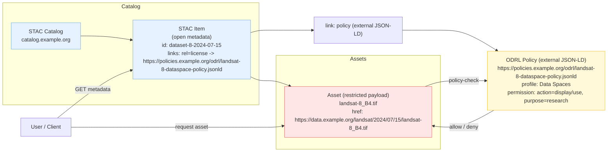

# Example STAC metadata 

Here we describe some patterns for creating STAC Collections and Items aligned with FAIR and the Data Space concept. 

The main idea is this: 

STAC only describes *what the data is and where to get it* — governance (license, rights),
provenance (where it came from), and rich description (DCAT) are kept **outside** STAC and referenced through typed links. 

As part of our tests we need to decide whether to embed external metadata in the STAC JSON or 
to reference it via typed links; embedding makes Items heavier and requires versioning, while linking keeps Items lightweight.


This README is a quick guide to that pattern, and a few simple examples. 


This is still exploratory. We're testing what a STAC-based Data Product pattern looks like for this Data Space. 


## Why STAC, in a Data Space

A Data Space (per the [DSSC Blueprint](https://archive.dssc.eu/space/Glossary/176554052/2.+Core+Concepts))
is built from a handful of separable building blocks: 

- **Data, Services & Offerings Descriptions** (like DCAT), 
- **Publication & Discovery**, (like STAC)
- **Provenance & Traceability** (PROV-O), and 
- **Access & Usage Policies and Control** (ODRL). 

Each is its own standard. This is on purpose as data space is meant to
federate participants who each bring their own catalogues, so the pieces
have to stay decoupled rather than baked into one format.

STAC fits naturally into the *Data Description + Discovery* aspects here. It's already a machine-readable, geospatially-aware catalogue
format with a working ecosystem (clients, APIs, extensions) and can  plug into the other building blocks. 


## Examples in this repo

Three different ways to include the metadata. 


- **[`stac-data-space-bmd-example.json`](https://github.com/Biodiversity-Meets-Data/BiodiversityDataSpace/blob/main/STAC-tests/examples/stac-data-space-bmd-example.json)**
  — a Collection showing  `describedby`
  → DCAT, a namespaced ODRL link rel, `cite-as` → DOI resolver alongside a
  `sci:doi` property from the `scientific` extension, and
  `producer`/`host`/`licensor` provider roles. 

- **[`stac-item-with-embedded-odrl-dataspaces.json`](https://github.com/Biodiversity-Meets-Data/BiodiversityDataSpace/blob/main/STAC-tests/examples/stac-item-with-embedded-odrl-dataspaces.json)**
  — This show how embedding ODRL detail can be: the full ODRL policy (JSON-LD, `odrl:policy`) is 
  embedded directly inside `properties`, not linked. This can be part of further tests to to see  what
  embedding actually costs. The Item now has to carry, version, and keep
  in sync a whole external vocabulary's document instead of a pointer to
  one. 

- **[`stac-item-with-external-odrl-dataspaces.json`](https://github.com/Biodiversity-Meets-Data/BiodiversityDataSpace/blob/main/STAC-tests/examples/stac-item-with-external-odrl-dataspaces.json)**
  — the Item stays clean and the ODRL document is external, but it's
  reached through a plain `rel: "license"` link rather than a
  namespaced ODRL relation. 
  

## The pattern

An STAC Item stays lightweight. Anything that isn't "what/where" is a pointer to
an external entity.



Ideally, the item should not be overloaded with ODRL, DCAT, or PROV content. 
Same idea applies to provenance and attribution: the Item says *who
produced / provided the data* and *where it came from* via a `providers`
list and links. 


## Minimum metadata to check 

- **License** — a `license` link (or SPDX string) pointing to real license
  terms, not just an opaque file with no context.
- **Provider / producer** — who actually made the source data, distinct
  from whoever re-packaged it for this catalog.
- **Provenance** — a link back to the original dataset/service this Item
  was derived from, so a consumer can trace it upstream.

Operational fields (auth scheme, storage endpoint, checksums) can belong
directly on the Item, because Items are often fetched programmatically.

Governance and provenance can live on the Collection level and be reached via the Item's `collection`
link. 


## Example: `natura2000 data`

This Item reuses Natura 2000 site data originally produced by the
**European Environment Agency (EEA)**. 


```json
"providers": [
  { "name": "European Environment Agency", "roles": ["licensor", "producer"], "url": "https://www.eea.europa.eu/" },
  { "name": "<this catalog's operator>", "roles": ["processor", "host"] }
],
"links": [
  { "rel": "license", "href": "<real EEA/Natura2000 license terms URL>", "type": "text/html" },
  { "rel": "derived_from", "href": "<original EEA Natura2000 dataset URL>", "type": "text/html", "title": "Source dataset (EEA)" }
]
```


## Reference

- STAC spec: link relations, provider roles, extensions —
  https://github.com/radiantearth/stac-spec
- `authentication`, `alternate-assets`, `scientific`, `file` extensions —
  https://stac-extensions.github.io/
